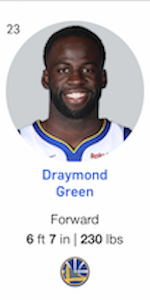
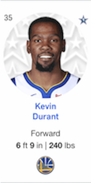
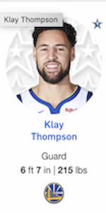
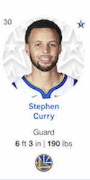

Workout 1
================
Anusha Dandamudi

### How Do GSW Players Compare to Each Other?

The Golden State Warriors are back at it again. It is indubitable that they are making history, having won multiple championships in the last few years. With a multitude of highly skilled players of varying backgrounds and experience and with a team of undeniable grit and sportsmanship, the GSW have been named champions. There is so much talk about the star players on the team and their superhuman shooting abilities. Let's take a look at five popular GSW players: Andre Iguodala, Draymond Green, Kevin Durant, Klay Thompson, and Stephen Curry and see how their shooting experience and abilities compare. To do this, we will analyze each player's shot statistics from 2016, visualize their shot accuracies for 2-pt field goals as well as 3-pt field goals, and determine which of these players have the best 2-pt and 3-pt records in 2016.

Before we get into the analysis and visualization of the statistics, I wanted to provide a bit of background about the Golden State Warriors and the players we will be taking a look at for those not familiar with the team.

The Golden State Warriors is a professional basketball team now based in Oakland, California. The team was actually founded in Philadephia in 1946 and the team relocated to the San Francisco Bay Area in 1962. There have been nicknamed the "Dubs" as a shorthand for "W" and hold the record of the best ever regular season as well as the best ever postseason run. With the players' incredible shooting record and team's achievements, it is no surprise that the team is among tne top 10 highest valued sports franchise in the United States. As stated earlier, each player has a strong and unique skillset but this study narrows in on the number of field goals each make.

Here are the five Golden State Warriors players we will be looking at.

    

Now, let's take a look at the data used in the study. I used the statistics collected by the NBA on each of the players in the year 2016. Here is a sample of the format of one player's data:

    ##               team_name game_date season period minutes_remaining
    ## 1 Golden State Warriors  12/15/16   2016      3                 3
    ## 2 Golden State Warriors  10/28/16   2016      3                 9
    ## 3 Golden State Warriors   11/1/16   2016      2                 5
    ## 4 Golden State Warriors   12/1/16   2016      3                 5
    ## 5 Golden State Warriors    4/4/17   2016      3                 2
    ## 6 Golden State Warriors  11/19/16   2016      4                 5
    ##   seconds_remaining shot_made_flag                    action_type
    ## 1                51              y Cutting Finger Roll Layup Shot
    ## 2                14              y Cutting Finger Roll Layup Shot
    ## 3                 8              y Cutting Finger Roll Layup Shot
    ## 4                27              y Cutting Finger Roll Layup Shot
    ## 5                 4              y Cutting Finger Roll Layup Shot
    ## 6                36              y Cutting Finger Roll Layup Shot
    ##        shot_type shot_distance               opponent   x  y
    ## 1 2PT Field Goal             3        New York Knicks  25 21
    ## 2 2PT Field Goal             2   New Orleans Pelicans   9 26
    ## 3 2PT Field Goal             2 Portland Trail Blazers -22  2
    ## 4 2PT Field Goal             0        Houston Rockets   2  7
    ## 5 2PT Field Goal             2 Minnesota Timberwolves   1 26
    ## 6 2PT Field Goal             0        Milwaukee Bucks   2  7

I had data for all five players formatted in the same way as above. To better visualize the shot statistics of each player side-by-side, I combined all data for these players into a single table. For each player, I wanted to visualize the number of shots they took in the season, from where on the court they took the shot, and if the shot was successful or not. Below is a facetted chart of each of the five players attempted shots of 2016.

    ## Warning: package 'dplyr' was built under R version 3.5.2

    ## 
    ## Attaching package: 'dplyr'

    ## The following objects are masked from 'package:stats':
    ## 
    ##     filter, lag

    ## The following objects are masked from 'package:base':
    ## 
    ##     intersect, setdiff, setequal, union

 Note that the green points indicate that the shot the player made was successful and the red points indicate that the shot was unsuccessful.

As can be seen from the above visual, Kevin Durant, Klay Thompson, and Stephen Curry made far more attempted shots and from all over the court than Andre Iguodala and Draymond Green. They are the primary players who aggressively play offense so that is no surprise. All players seem to have approximately the same percentage of successful shots, but let's take a closer look at that now.

Considering just 2-pt field goals, the statistics on each player's 2-pt field attempts, the number of successful 2-pt field goals, and a success rate are given by the table below.

##### 2PT Effective Shooting % by Player

    ##             name total_shots made_shots percentage
    ## 1 Andre Iguodala         210        134  0.6380952
    ## 2   Kevin Durant         643        390  0.6065319
    ## 3  Stephen Curry         563        304  0.5399645
    ## 4  Klay Thompson         640        329  0.5140625
    ## 5 Draymond Green         346        171  0.4942197

Even though Andre Iguodala made far fewer 2-pt field goal attempts in 2016, he had a phenomenal success rate of almost 64 percent. Although Kevin Durant is acclaimed for his 3-pointers, he closely trailed Iguodala with over a 60 percent success rate. It is clear that Iguodala and Durant had a solid 2-pt field goal performance in 2016.

Considering just 3-pt field goals, the statistics on each player's 3-pt field attempts, the number of successful 3-pt field goals, and a success rate are given by the table below.

##### 3PT Effective Shooting % by Player

    ##             name total_shots made_shots percentage
    ## 1  Klay Thompson         580        246  0.4241379
    ## 2  Stephen Curry         687        280  0.4075691
    ## 3   Kevin Durant         272        105  0.3860294
    ## 4 Andre Iguodala         161         58  0.3602484
    ## 5 Draymond Green         232         74  0.3189655

It is no surprise that Klay Thompson and Stephen Curry have the highest 3-pt field goal success rate. The Splash Brothers both have godly 3-pt field goal accuracy compared to any other players we have seen. The other three players attempt far fewer 3-pt field goals, but their sucess rate is still rather high.

Looking at all field goals, the statistics on each player's field goal attempts, the number of successful field goals, and a success rate are given by the table below.

##### Effective Shooting % by Player

    ##             name total_shots made_shots percentage
    ## 1   Kevin Durant         915        495  0.5409836
    ## 2 Andre Iguodala         371        192  0.5175202
    ## 3  Klay Thompson        1220        575  0.4713115
    ## 4  Stephen Curry        1250        584  0.4672000
    ## 5 Draymond Green         578        245  0.4238754

Kevin Durant leads the pack with an unsettling 54 percent field goal accuracy in 2016. The Golden State Warriors were a great team before Durant switched from the Oklahoma Thunders, but his addition unequivocally bolstered the team's offense. The Splash Brothers make a lot of field goal attempts, and both player's success rate hovers around 47 percent. Although Andre Iguodala is not as famous for his field goals as Durant, Thompson, and Curry, he has great precision with a success rate just below Durant.

Each of the five players have something unique to contribute to the team, whether it be on the offense or the defense. Durant, Thompson, and Curry are more focused on offense and make a much larger percentage of field goals attempts compared to Iguodala and Green. However, Iguodala has great precision for making 2-pt field goals, while Thompson and Curry come out on top when considering 3-pt field goals. When considering all field goal attempts, Durant leads the way. Green appears to be the weakest player when considering field goals in 2016, but he adds immense value to the defense side of things. In the end, all players have great offense skills compared to players on other teams, but Iguodala, Durant, Thompson, and Curry seen to be the strongest, each in their own category.

And that's a slam dunk. ⛹🏽🏀

References:

-   <https://en.wikipedia.org/wiki/Golden_State_Warriors>
-   <https://www.nba.com/teams/warriors>
